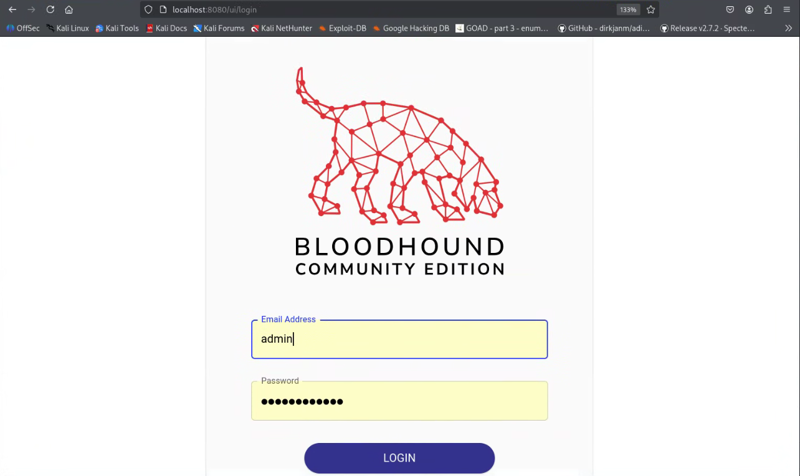
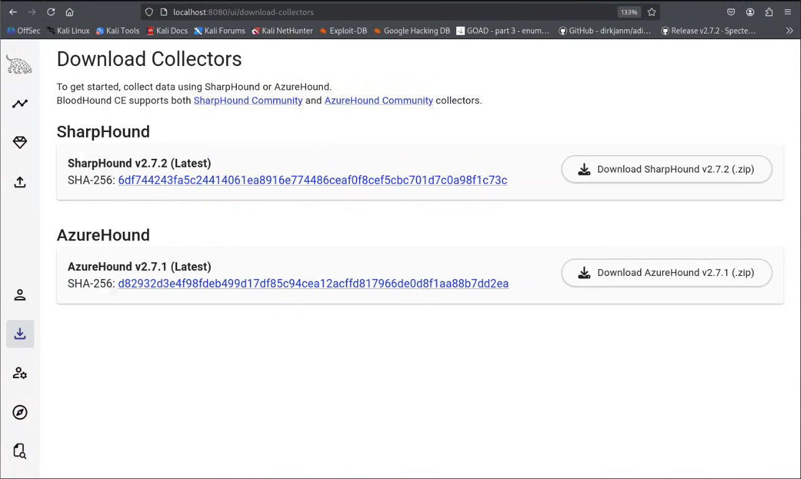

# Guide to installing latest BloodHound tools on kali Linux and How to use them.
<p align="center">
     
</p>


## Background
Bloodhound was changed to <b>BloodHound Community Edition (CE)</b> with the release of version 5.0 on August 1, 2023. SpecterOps announced that this rebranding reflected the project's focus on the open-source community.

The new version uses <b>Docker Compose</b> for easier deployment and features a more modern web application interface, making it easier for users to manage and utilize the tool.

As a user who has not used this newer version of BloodHoud, I quickly encountered some issues installing it on the latest Kali Linux. I deceided to write this Guide to help others that may encounder these same issues.

## Preperation Steps
Installing <b>docker</b> and <b>docker compose</b> on kali linux

Start by doing an update/upgrade:
```
$ sudo apt update
$ sudo apt upgrade
```

Next try to install Docker by doing:
```
$ sudo apt install docker
```

We get an error:

Package docker is not available, but is referred to by another package.
This may mean that the package is missing, has been obsoleted, or is only available from another source
However the following packages replace it:
  wmdocker
Error: Package 'docker' has no installation candidate

Ah, the classic Kali Linux + Docker repo mismatch. This happens because Kali uses the <b>kali-rolling</b> codename, which isn’t officially supported by Docker’s Debian repository. Docker doesn’t publish a Release file for kali-rolling, so apt throws a fit.

<b>How to Fix It</b>

You can work around this by using a compatible Debian codename like <b>bullseye</b> instead:

1.	Edit the Docker source list:
```
sudo nano /etc/apt/sources.list.d/docker.list
```

Replace:
```
deb [arch=amd64 signed-by=/etc/apt/keyrings/docker.asc] https://download.docker.com/linux/debian kali-rolling stable
```

With:
```
echo "deb [arch=amd64 signed-by=/etc/apt/keyrings/docker.gpg] https://download.docker.com/linux/debian bullseye stable" | sudo tee /etc/apt/sources.list.d/docker.list > /dev/null 
```
2.	Download the correct GPG key
```
sudo mkdir -p /etc/apt/keyrings

curl -fsSL https://download.docker.com/linux/debian/gpg | sudo gpg --dearmor -o /etc/apt/keyrings/docker.gpg
```

3.	Set proper permissions
```
sudo chmod a+r /etc/apt/keyrings/docker.gpg
```

4.	Update your package list:
```
sudo apt-get update
```

5.	Install Docker:
```
sudo apt-get install docker-ce docker-ce-cli containerd.io docker-buildx-plugin docker-compose-plugin
```

This workaround has been confirmed by other Kali users to work smoothly. Just keep in mind that since Kali isn’t officially supported, future updates might require similar tweaks.

6. Verify docker install:
```
$ docker –v
Docker version 28.5.0, build 887030f
```

7. Verify docker compose
```
$ docker compose version
Docker Compose version v2.39.4
```

8. Start and Enable the docker Daemon
```
$ sudo systemctl start docker
$ sudo systemctl enable docker
```

## Time to install Bloodhound-CE.
<p align="center">
     
</p>

1. Switch to Download directory
```
$ cd ~/Downloads
```

2. Download the latest bloodhound-cli
```
$ wget https://github.com/SpecterOps/bloodhound-cli/releases/latest/download/bloodhound-cli-linux-amd64.tar.gz
```

3. Unpack the file
```
tar -xvzf bloodhound-cli-linux-amd64.tar.gz
```

4. Set the Docker Group
```
sudo usermod -aG docker $USER
```

5. In your terminal, enter the following command to install BloodHound Community Edition via BloodHound CLI:
```
$ sudo ./bloodhound-cli install
```

6. The installation will now proceed. You’ll know it’s complete when you see the randomly generated password displayed on your screen. Make sure to keep your terminal open until you have changed your password in a future step.

```
[+] Checking the status of Docker and the Compose plugin...
[+] Starting BloodHound environment installation
[+] Downloading the production YAML file from https://raw.githubusercontent.com/SpecterOps/BloodHound_CLI/refs/heads/main/docker-compose.yml...
[+] Downloading the development YAML file from https://raw.githubusercontent.com/SpecterOps/BloodHound_CLI/refs/heads/main/docker-compose.dev.yml...

[… downloading lots of files …]

Network root_default  Creating
Network root_default  Created
Volume "root_postgres-data"  Creating
Volume "root_postgres-data"  Created
Volume "root_neo4j-data"  Creating
Volume "root_neo4j-data"  Created
Container root-graph-db-1  Creating
Container root-app-db-1  Creating
Container root-app-db-1  Created
Container root-graph-db-1  Created
Container root-bloodhound-1  Creating
Container root-bloodhound-1  Created
Container root-app-db-1  Starting
Container root-graph-db-1  Starting
Container root-app-db-1  Started
Container root-graph-db-1  Started
Container root-app-db-1  Waiting
Container root-graph-db-1  Waiting
Container root-app-db-1  Healthy
Container root-graph-db-1  Healthy
Container root-bloodhound-1  Starting
Container root-bloodhound-1  Started
[+] BloodHound is ready to go!
[+] You can log in as `admin` with this password: 1WBhSFbPTurX1xBrUPUky5eqxv4wtZ26
[+] You can get your admin password by running: bloodhound-cli config get default_password
[+] You can access the BloodHound UI at: http://127.0.0.1:8080/ui/login
```
If you lose the password, you can reset it locally using BloodHound CLI:
```
$ ./bloodhound-cli resetpwd
```

7. Go to <b>http://localhost:8080/ui/login</b>, and log in with <b>admin</b> and the <b>randomly generated password</b> from the last installation step.

8. Reset the password as prompted.
You’re now logged in to a locally hosted <b>BloodHound CE</b> tenant running with <b>Docker Compose</b>.

<p align="center">
     
</p>


FYI - I usually set my new password to <b>Bloodhound1!</b>.

## Time to load some real Data into BloodHound CE

1. No we need an injestor (collector) program to get the data from the AD instances into a format that Bloodhound needs for upload.

There are three options:
- Sharphound
- AzureHound
- Bloodhound-ce-python

The Sharphound collector is built in to BlooodHound-CE.
<p align="center">
     
</p>

<B>SharpHound.exe</b> is designed to be <b>downloaded</b> to your target <b>Domain Controller</b> and run from <b>PowerShell</b>. 

I am not using Azure, so I will skip it for now.

<b>Bloodhound-CE-python</b> is my collector of choice.

To install it on <b>kali</b> use:
```
sudo apt install bloodhound-ce-python
```

At that point you should be able to try it:
```
$ bloodhound-ce-python
                                                              
INFO: BloodHound.py for BloodHound Community Edition
usage: bloodhound-ce-python [-h] [-c COLLECTIONMETHOD] [-d DOMAIN] [-v] [-u USERNAME] [-p PASSWORD] [-k] [--hashes HASHES] [-no-pass] [-aesKey hex key]
[--auth-method {auto,ntlm,kerberos}] [-ns NAMESERVER] [--dns-tcp] [--dns-timeout DNS_TIMEOUT] [-dc HOST] [-gc HOST] [-w WORKERS]
[--exclude-dcs] [--disable-pooling] [--disable-autogc] [--zip] [--computerfile COMPUTERFILE] [--cachefile CACHEFILE]
[--ldap-channel-binding] [--use-ldaps] [-op PREFIX_NAME]

...

```
## Time to collect some data from our GOAD Lab in preperation of uploading it into BloodHound CE.

Stay tuned... more to come.